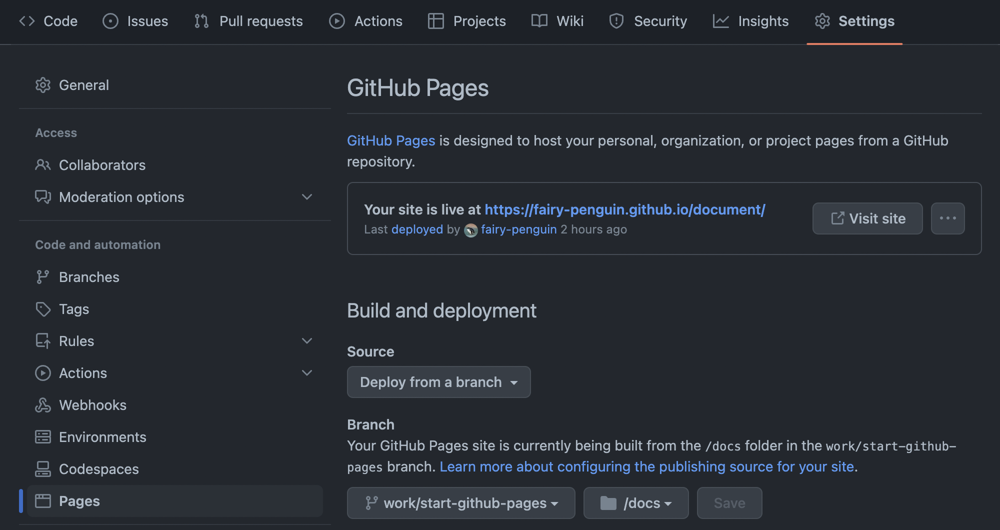
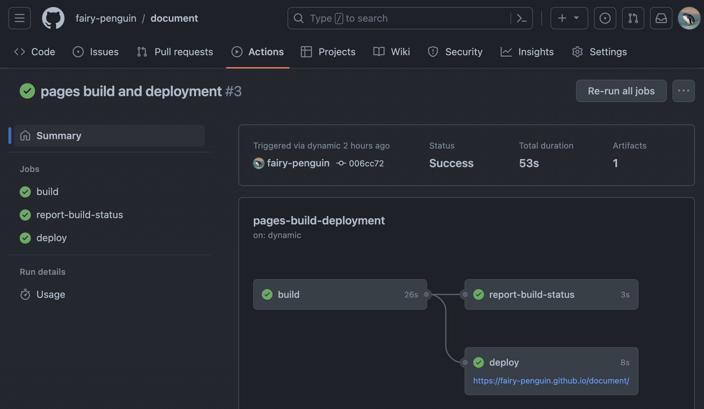
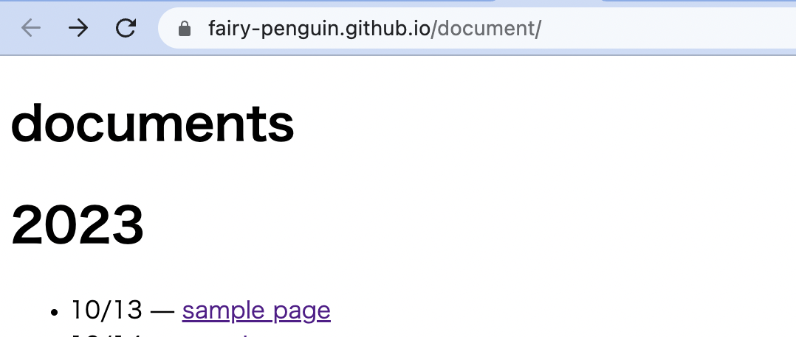
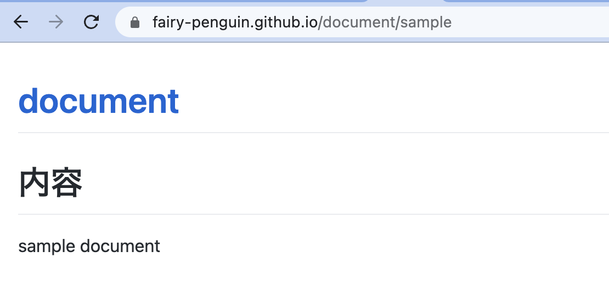

# 目次


# 内容
github pagesを使い始める際の初期設定や、サンプルページを表示するまでの流れを説明します。

# 背景
これまで、自分自身のノウハウ整理は全てnotionの個人アカウントに書き溜めていましたが、
コードのサンプルと共に外部公開して使用したい場面が増えたため、github pagesに移行することにしました。

htmlやcssを使ってこだわり始めるとキリがなく、肝心なノウハウを書くまでに疲れて投げ出しそうなので、最も簡単なところからスタートすべく、markdownのシンプルな構成でスタートします。

# 手順の概要
公開したいドキュメントを配置するリポジトリを作成し、pagesで公開するための設定を行う大まかな手順は以下です。

- githubのブラウザ上で `document` という名前の `public` リポジトリを作成する
- 自分のローカル環境にcloneし、docsとimageというディレクトリを作成する
- docsディレクトリ内に`index.html`、`sample.md`というファイルを作成する
- githubのブラウザ上で、pagesで公開するブランチやディレクトリの設定をする

以下ではそれぞれをより詳細に書いています。

# ローカル環境へのcloneとディレクトリ等の作成
githubのブラウザ画面からリポジトリを作成したら、以下の操作でリポジトリをcloneし、ディレクトリなどを作成します。
``` sh:terminal
$ cd [cloneしたい場所]

# エンタープライズで複数githubアカウントを使っているため、自分のアカウントのSSH接続にエイリアスを使用中
# HTTPで通常のcloneをする場合は $ git clone https://github.com/fairy-penguin/document.git
# HTTPで通常のcloneをする場合は $ git clone git@github.com:fairy-penguin/document.git

$ git clone git@fairy-penguin.github.com:fairy-penguin/document.git

$ cd document

$ git checkout -b work/start-github-pages 

$ mkdir docs

$ mkdir images

$ touch docs/index.html

$ touch docs/sample.md

```

# ファイルの中身を書く
ここまで済んだら、`index.html`と`sample.md`の中身を簡単に書いて行きます。

```html:index.html
<!DOCTYPE html>
<html lang="ja">
<head>
    <meta charset="utf-8">
    <meta http-equiv="X-UA-Compatible" content="IE=edge">
    <meta name="viewport" content="width=device-width, initial-scale=1">

	<meta property="og:locale" content="ja_JP" />
    <meta property="og:site_name" content="documents">
    <meta property="og:type" content="article">    
</head>

<header class="intro-header" style="background-image: url('/')">
    <div class="container">
        <div class="row">
            <div class="col-lg-8 col-lg-offset-2 col-md-10 col-md-offset-1 ">
                <div class="site-heading">
                    <h1>documents</h1>
                    
		    <span class="subheading"></span>
                </div>
            </div>
        </div>
    </div>
</header>

<div class="container">
    <div class="row">
   	    <div class="
            col-lg-8 col-lg-offset-1
            col-md-8 col-md-offset-1
            col-sm-12
            col-xs-12
            post-container
        ">
            <div class="archive-list">             
             <h1 class="title is-4 has-text-weight-normal">2023</h1>

        <ul>
            <li>
                <span>10/13</span> — 
                <a href="sample">
                    sample page
                </a>
            </li>
        </ul>               
         
</body>
</html>
```


```md:sample.md
# 内容

sample document

```

ここまで実施したら以下のコマンドでリモートリポジトリにpushします。

```sh:terminal
$ git status

$ git add .

$ git commit -m "add sample files"

$ git push origin work/start-github-pages 
```

# pagesで公開するブランチやディレクトリの設定をする

以下画像のように、documentリポジトリの画面から上部タブ「setting」を選択し、サイドバーから「pages」を選択します。



ここで以下の項目を設定します
- build & deployの方法：from branch
- 公開するブランチ：`work/start-github-pages`
- 公開するルートディレクトリ：`/docs`

今回の設定では、ここで設定したブランチへのコミットを契機に、pagesのbuildとdeploy(pages側で用意してくれるactionsのワークフロー)が走り、設定したルートディレクトリ配下にある`index.html`がWEBページとして公開されます。


実際に、このリポジトリのactionsを見てみると、以下のようにワークフローが実行され、デプロイされていることが確認できます。



このデプロイ結果に表示されているURLを開いてみると、きちんと`index.html`が表示され、中身の`sample.md`もみられるようになっていました。


